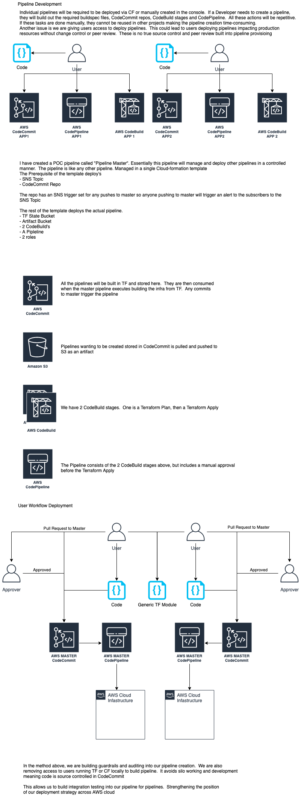

# Pipelines of Pipelines - POP
## The Problem
CI/CD is a method to frequently deliver apps to customers by introducing automation into the stages of app development. The main concepts attributed to CI/CD are continuous integration, continuous delivery, and continuous deployment. CI/CD is a solution to the problems integrating new code can cause for development and operations teams 

I had an issue whereby implementing CI/CD was not automated, nor source controlled. This is the first release of a CFN template to implementing MASTER pipeline to mananage sub child pipelines soley managed with source control.  This is to implement controls and security around the initial deployment of the CI/CD infrastructure.  Since the pipelines do not exist, we need a means to deploy the CI/CD pipelines in a controled and secure manner.  For this we are deploying a Pipeline of Pipelines - POP.

## Pipeline of Pipelines - POP
The principle around Pipeline of Pipelines - POP is to manage, control and secure the delivery of CI/CD to AWS

The Pipeline is written in CloudFormation so changes can be controled and captured while stored in your flavour of source control (GitHub / CodeCommit)

The principle of the POP is to control, manage and secure pipelines.

